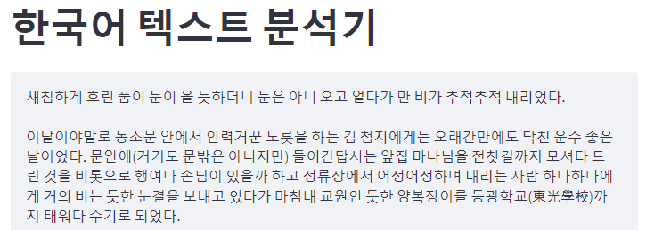
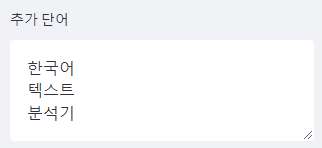
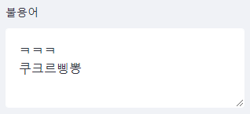
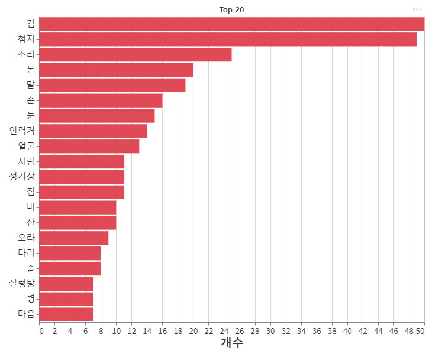

# 한국어 텍스트 분석기
한국어 텍스트 분석기는 코드 작성 없이 간단하게 사용 할 수 있습니다.
- **워드클라우드**: 분석 결과를 시각화 합니다. 빈도수가 높은 단어일 수록 크게 표기됩니다.
- **단어 빈도수**: 단어 빈도수를 막대 그래프로 표현합니다.

## 구현
- **형태소 분석**: Kiwi 형태소 분석기 (10.5281/zenodo.7041425) 를 사용하여 형태소 분석을 수행합니다.  
https://github.com/bab2min/Kiwi
- **Web App**: 한국어 텍스트 분석기는 `streamlit` 을 활용하여 구성하였습니다.  
https://streamlit.io


## 실행
아래 명령을 통해 `main.py` 파일을 실행합니다.
```python
streamlit run main.py
```

## DEMO APP
아래 링크를 통해 Web App 을 사용해 볼 수 있습니다.  
https://phykn-korean-text-analyzer-main-lha9a2.streamlitapp.com

## 사용 방법
- **텍스트 입력**: 중앙 텍스트 입력창에 분석할 텍스트를 입력합니다. `Ctrl+Enter` 로 입력한 텍스트를 적용합니다.  
    

- **옵션**: 텍스트 분석에 필요한 옵션을 지정할 수 있습니다.
    - **추가 단어**: 분석에 추가할 단어를 입력합니다.    
        

    - **불용어**: 분석에 제거할 단어를 입력합니다.  
        

    - **배경 이미지**: 워드클라우드의 배경이미지를 선택합니다.
    - **품사**: 분석할 품사를 선택합니다. 기본값은 `일반 명사`, `고유 명사` 입니다.
    - **빈도수 표기 개수**: 막대그래프에 표기할 데이터 개수를 설정합니다.
    - **Download (.csv)**: 단어 빈도수 결과 `csv` 파일을 다운로드 합니다.

## 결과 예시
- **워드클라우드**  

| dolphin.png | shin.png | pika.png |
| :---: | :---: | :---: |
|  |  |  |

- **단어 빈도수**  


## 출처
1. `Kiwi`: https://github.com/bab2min/Kiwi, 10.5281/zenodo.7041425
2. shin.png: https://static.wikia.nocookie.net/love-live-fanon/images/9/98/Shinchan.png
3. dolphin.png: https://cdn.pixabay.com/photo/2022/02/27/04/58/dolphin-7036679_960_720.png
4. pika.png: https://pbs.twimg.com/media/CnkW78cXYAADwMv.jpg
5. 나눔글꼴: https://hangeul.naver.com/font  
